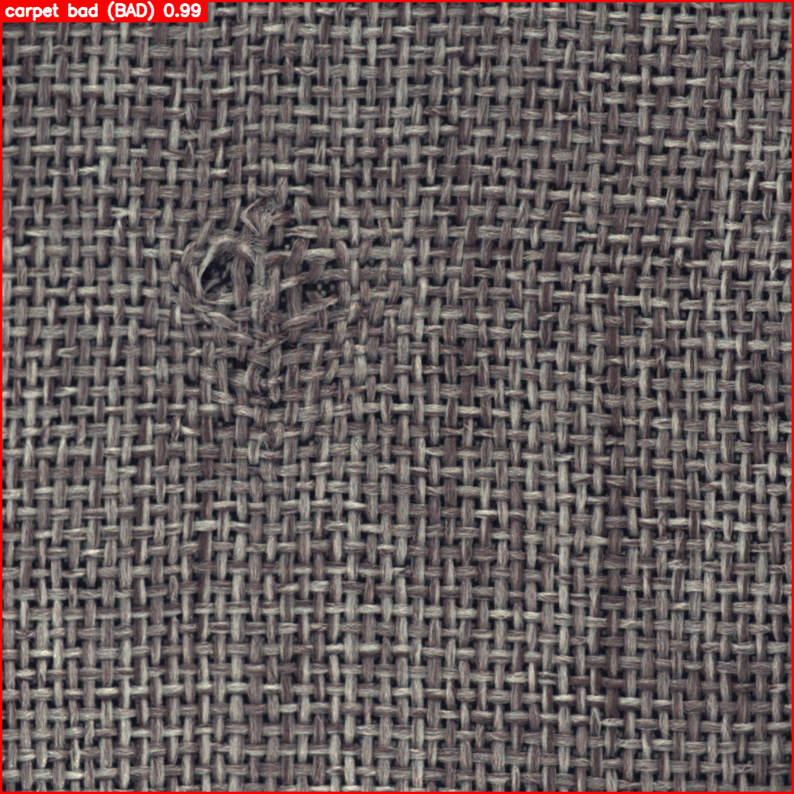
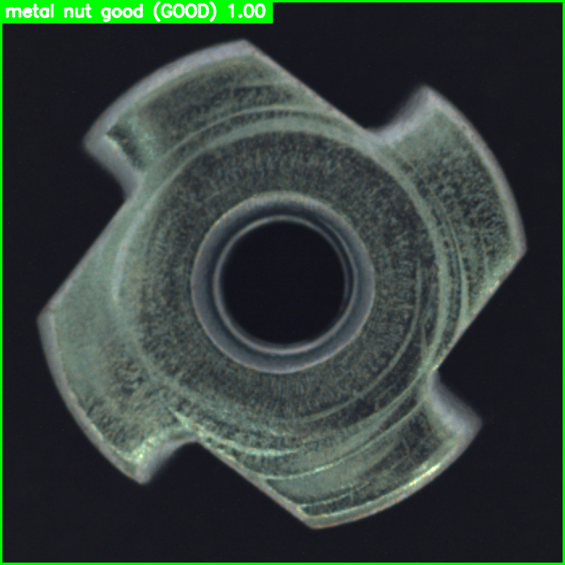

# YOLO Industrial Object Detection  
High-Accuracy Industrial Defect Detection (GOOD/BAD) + Multi-Class Object Identification  
Trained with GPU (CUDA) using Ultralytics YOLO & OpenCV

<p align="center">

  <!-- Kaggle -->
  

  <!-- OpenCV -->
  

  <!-- PyTorch -->
  

  <!-- NVIDIA -->
  

  <!-- Python -->
  

</p>


---

## 🚀 Overview
This project performs **industrial-quality inspection** using state-of-the-art **YOLO object detection**.

The system identifies:
- Object type (e.g., **bottle**, **screw**, **tile**, **wood**, …)
- Whether the object is **GOOD** or **BAD**
- Draws bounding boxes:
  - 🟩 Green = GOOD  
  - 🟥 Red = BAD  
- Supports single image + batch folder processing  
- Fully GPU accelerated using CUDA

---

## 📸 Sample Detection Outputs

### BAD Example
<p align="center">
  
</p>

### GOOD Example
<p align="center">
  
</p>

---

## 🧠 Technologies Used
- **Ultralytics YOLO**
- **OpenCV**
- **PyTorch**
- **NVIDIA CUDA GPU**
- **Python 3.10**

---


## 📦 Project Features  
- YOLOv11 object detection  
- Detect industrial objects (bottle, cable, screw, tile, wood, etc.)  
- Classify each object as **GOOD** or **BAD**  
- Draw **green** boxes for GOOD and **red** boxes for BAD  
- Save annotated output images  
- Full-folder batch processing  
- Auto dataset conversion for MVTec AD  
- Ready for production deployment  

---


## 📥 Installation for Requirements

Clone the repository:

```bash
git clone https://github.com/Mehdipoladrag/yolo-industrial-detection.git
cd yolo-industrial-object-detection
```

Create & activate virtual environment:


```
Python 3.10+
ultralytics
opencv-python
numpy
torch
```

```bash
python -m venv .venv
```

**Windows:**
```bash
.venv\Scripts\activate
```

**Linux / macOS:**
```bash
source .venv/bin/activate
```

Install dependencies:

```bash
pip install -r requirements.txt
```

## 🛠 Dataset Preparation (MVTec AD → YOLO)

Run the dataset converter:

```bash
python src/data_preparation/convert_dataset.py
```

This generates:

```
data/mvtec_yolo/
    images/train/
    labels/train/
    images/val/
    labels/val/
```

Dataset YAML (`data.yaml`):

```yaml
path: data/mvtec_yolo

train: images/train
val: images/val

names:
  0: good
  1: bad
```

---

## 🚀 Training YOLO

```bash
yolo detect train model=yolo11s.pt data=data.yaml epochs=100 imgsz=640 batch=16 device=0
```

The best model is saved at:

```
runs/detect/train*/weights/best.pt
```
---


## 🤝 Contributing

Pull requests are welcome — feel free to improve dataset tools or add new industrial models.

---
## 🔗 Social Links

<p align="center">

  <!-- GitHub -->
  <a href="https://github.com/Mehdipoladrag" target="_blank">
    
  </a>

  <!-- LinkedIn -->
  <a href="https://www.linkedin.com/in/mehdi-pouladrag" target="_blank">
    
  </a>

  <!-- Kaggle -->
  <a href="https://www.kaggle.com/mehdip1" target="_blank">
    
  </a>

</p>

## 📜 License

MIT License — free for personal and commercial use.